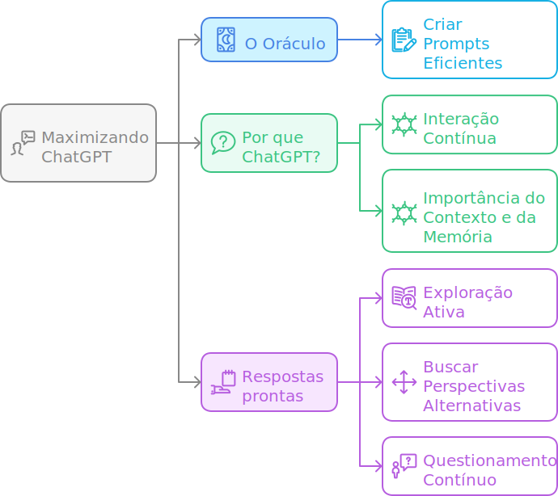

import ClassificarPrompt from '@site/src/components/ClassificarPrompt'
import IconPrompt from '@theme/Icon/Arrow';
import LigaHighlight from '@site/src/components/gsap/highlight'

# Construção
<LigaHighlight />

Neste capítulo, exploraremos diferentes formas de aproveitar ao máximo o ChatGPT, destacando seu uso como uma ferramenta interativa e dinâmica que vai além de respostas simples. O ChatGPT oferece a oportunidade de aprimorar o processo de questionamento, transformar diálogos em *insights* valiosos e incentivar uma abordagem crítica para obter respostas mais completas e informadas.

Na seção *O Oráculo* você aprenderá como o ChatGPT pode guiar a criação de prompts mais eficientes e objetivos. A clareza e a especificidade são essenciais para obter respostas de qualidade, e este conteúdo mostra como o modelo pode atuar não apenas como respondente, mas também como um assistente na formulação de perguntas eficazes.

Em seguida, *Por que ChatGPT?* mergulha na essência do nome da ferramenta, explicando como o "chat" reflete a natureza contínua e contextual da interação. Este capítulo explora como a manutenção do contexto e a memória influenciam a fluidez do diálogo, tornando a conversa com o ChatGPT mais próxima de uma interação humana.

Por fim, *Respostas prontas* oferece um alerta importante sobre o uso passivo de respostas sintetizadas. Vamos discutir como a exploração ativa, a solicitação de perspectivas alternativas e o questionamento contínuo podem levar a uma compreensão mais profunda e completa dos assuntos abordados. Aqui, você verá como o ChatGPT pode ser usado para expandir seu pensamento crítico e fomentar diálogos mais ricos e significativos.

Neste capítulo forneço uma visão abrangente sobre como maximizar o uso do ChatGPT, não apenas como uma ferramenta de resposta, mas como um verdadeiro parceiro de trabalho.